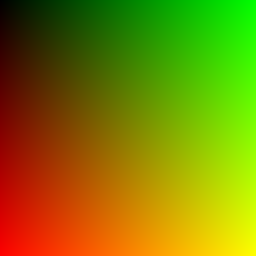

# BMP# (bmp-sharp)

Simple .NET fully managed .NetStandard C# library for handling Bitmap (BMP) files.

## Description

This is simple Bitmap library that helps you wrap binary data (pixels) into BMP header for saving into file and vice versa.

It supports only **24 bits BGR** and **32 bits BGRA** byte arrays.

Library supports x86 (little-endian) and ARM (big-endian).

Documentation on wiki pages.

## Why this library

I'm working on a library that will help me parse CIFAR 10 dataset and I wanted to simply display binary image data. Problem was that I couldn't find any .NET library that will take byte[] and with few parameters display it as image (without conversion into float or use Windows.System.Forms/WPF) so I wrote this simple library to help me out.

Also usefull for exporting [SkiaSharp] SKBitmap data (SkiaSharp doesn't supprot this Check issue [#320](https://github.com/mono/SkiaSharp/issues/320)).

~~~csharp
var outputImage = SkiaSharp.SKBitmap.Decode( imageFile );
if (!(outputImage.BytesPerPixel == 3 || outputImage.BytesPerPixel == 4))
	throw new Exception( $"Unsupported Bits per image ({outputImage.BytesPerPixel}) for BmpSharp" );

var bitsPerPixel = outputImage.BytesPerPixel == 4 ? BmpSharp.BitsPerPixelEnum.RGBA32 : BmpSharp.BitsPerPixelEnum.RGB24;
var bmp = new BmpSharp.Bitmap( outputImage.Width, outputImage.Height, outputImage.Bytes, bitsPerPixel );
return bmp.GetBmpBytes(flipped:true);	// returns BMP File as byte[] array
~~~

## Samples

In `sample` folder.

~~~csharp
public static byte[] GenerateRedGreen24BitGradient() {
	var width = 256;
	var height = 256;
	var bytesPerPixel = (int) BmpSharp.BytesPerPixelEnum.RGB24;
	var framebuffer = new byte[width * height * bytesPerPixel];

	for (var row = 0; row < height; row++) {
		for (var column = 0; column < width; column++) {
			long offset = ( row * height * bytesPerPixel ) + ( column * bytesPerPixel );
			framebuffer[offset] = 0; // blue
			framebuffer[offset + 1] = (byte) column; // green
			framebuffer[offset + 2] = (byte) row; // red
		}
	}
	return framebuffer;
}
var redGreenGradient = GenerateRedGreen24BitGradient();
var redGreenGradientBitmap = new Bitmap( 256, 256, redGreenGradient, BitsPerPixelEnum.RGB24 );
System.IO.File.WriteAllBytes( $"{nameof( redGreenGradient )}.bmp", redGreenGradientBitmap.GetBmpBytes() );
~~~

Result:

## Out of scope

- All different headers formats
- Image filtering
- Compression support (use PNG)
- 1/4/8 bits per pixel support (i'm open for pull requests)

## History

### 0.2.0 Bugfixes & RGBA32 Support

- Bug fixes and Code refactoring (there are code breaking changes from version 0.1.0).
- Added RGBA (alpha channel) support (32 bits)

### 0.1.0 Initial release

- Added support of saving byte[] to BMP
- Should support reading/saving of little/big endian platforms (x86 / ARM)
